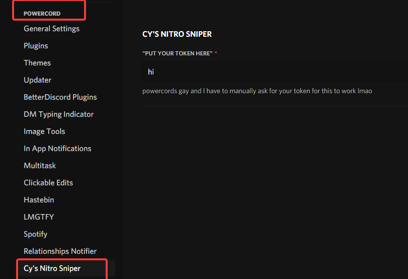

Questions:
```YAML
Q: Is it fast?
A: I wish I knew all I did was test if it worked

Q: How well does it work?
A: You figure that out

Q: Hey Cyrus why the hell did you make this?
A: couldn't tell you I'm just surprised it actually works
```

How to use:

Step 1.
```git clone https://github.com/Not-Cyrus/powercord-nitro-sniper.git```

Step 2. Find it here



Step 3. Put your token in, and enable it.
